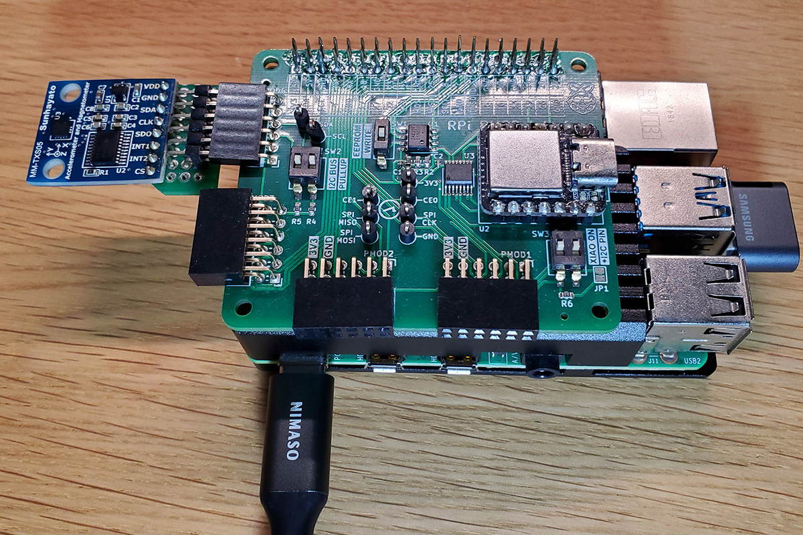

# Pi-LSM303D

[](https://github.com/fm4dd/pi-lsm303d/actions/workflows/rpi.yml)

## Background

**Note: This sensor code is unfinished - WIP!**

This is a C driver program for the STMicroelectronics LSM303D magnetic "eCompass" sensor via I2C on a Raspberry Pi. I used it with the Sunhayhato MM-TXS05 module, connected in I2C mode to the PMOD2RPI board's PMOD4 port on a Raspberry Pi 4.

[LSM303D IC datasheet](https://www.st.com/resource/en/datasheet/lsm303d.pdf)  
[MM-TXS05 module manual](http://www.kyohritsu.jp/eclib/OTHER/MANUAL/SUN/mmtxs05manual.pdf)



## I2C bus connection

For Raspberry Pi I2C communication functions, I am using the i2c-tools and i2c-dev packages.

```
sudo apt-get install -y i2c-tools libi2c-dev
```

The LSM303D sensor can communicate either through I2C or SPI. The correct communication mode is determined by the sensor monitoring the CS line. If CS stays high when incoming data is identified on SDA/SDI (MISO), then I2C mode is used. LSM303D keeps CS high, which enables I2C mode if CS is not connected. If I2C mode gets detected, the SDO pin becomes the I2C address selection pin SA. If SDO/SA is not connected, the pin is kept high and the sensor responds under address 0x1d. To select the alternate address 0x1e, pin SA needs to connect to GND. Keeping SDO/SA disconnected, the Sunhayhato MM-TXS05 module uses address 0x1d:

```
pi@pi-ms05:~/pmod2rpi/pi-lsm303d $ i2cdetect -y 1
     0  1  2  3  4  5  6  7  8  9  a  b  c  d  e  f
00:          -- -- -- -- -- -- -- -- -- -- -- -- --
10: -- -- -- -- -- -- -- -- -- -- -- -- -- 1d -- --
...
70: -- -- -- -- -- -- -- --

```

For I2C coding, the LSM303D sensor does not support "auto-increment" reads.

## Code compilation

Compiling the test program:
````
pi@pi-ms05:~/pmod2rpi/pi-lsm303d $ make
gcc -O3 -Wall -g   -c -o i2c_lsm303d.o i2c_lsm303d.c
gcc -O3 -Wall -g   -c -o getlsm303d.o getlsm303d.c
gcc i2c_lsm303d.o getlsm303d.o -o getlsm303d -lm
````

## Example output


The sensor register data can be dumped out with the "-d" argument:
```
pi@pi-ms05:~/pmod2rpi/pi-lsm303d $ ./getlsm303d -d
------------------------------------------------------
STMicroelectronics LSM303D register dump:
------------------------------------------------------
 reg    0  1  2  3  4  5  6  7  8  9  A  B  C  D  E  F
------------------------------------------------------
[0x00] -- -- -- -- -- 00 00 00 59 F9 24 FB 26 FA -- 49
[0x10] -- -- E8 00 00 00 00 00 00 00 00 00 00 00 00 00
[0x20] 07 00 00 00 18 20 03 00 F8 7F 08 80 08 80 00 20
[0x30] 00 00 00 00 00 00 00 00 00 00 00 00 00 00 00 00

Sensor Reg: hex  binary
---------------------------
TEMP_OUT_L: 0x00 0b00000000
TEMP_OUT_M: 0x00 0b00000000
  STATUS_M: 0x00 0b00000000
 OUT_X_L_M: 0x59 0b01011001
 OUT_X_H_M: 0xF9 0b11111001
 OUT_Y_L_M: 0x24 0b00100100
 OUT_Y_H_M: 0xFB 0b11111011
 OUT_Z_L_M: 0x26 0b00100110
 OUT_X_H_M: 0xFA 0b11111010
 WHO_AMI_I: 0x49 0b01001001
```
